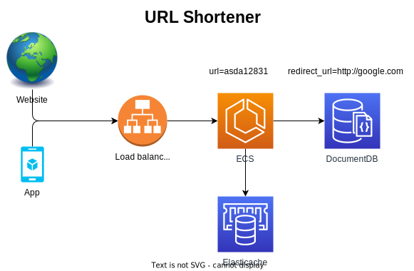

# URL Shortener

A URL shortener application built with AWS services.

## Architecture


## Business Requirements

- A user should be able to create a new shortened URL and receive a unique code for it.
- A user should be able to retrieve the original URL from the shortened code.
- A user should be redirected to the original URL when the shortened code is visited.

## Technical Requirements

### Route for creating a new shortened URL

Request:

POST /api/v1/shorten

```json
{
  "url": "https://www.google.com"
}
```

Response:

Status: 201 Created

```json
{
  "code": "asda12831"
}
```

### Route for retrieving the original URL from the shortened code

Request:

GET /api/v1/shorten/find?code=asda12831

Response:

Status: 200 OK

```json
{
  "url": "https://www.google.com"
}
```

Status: 404 Not Found

```json
{
  "error": "Not Found"
}
```

### Route for redirecting to the original URL

Request:

GET /api/v1/shorten/asda12831

Response:

Status: 302 Found

Location: https://www.google.com

Status: 404 Not Found

```json
{
  "error": "Not Found"
}
```